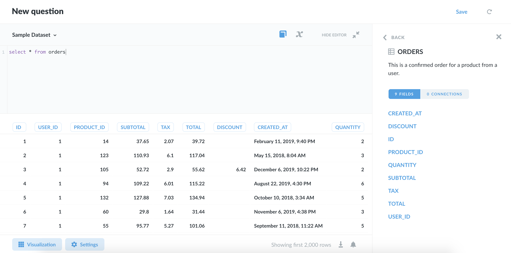
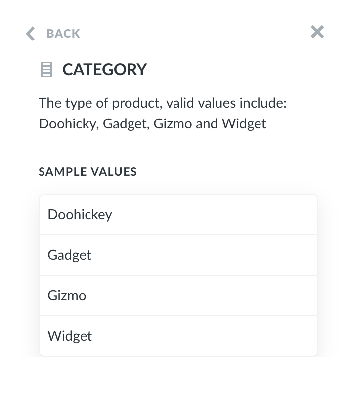

## Data Model Reference

---

Sometimes when you're writing a SQL query, you might forget the exact names of different tables or columns, or which table contains what. That’s where the _data reference_ comes in handy. You can open the data reference panel from the SQL editor by clicking on the book icon in the top right corner of the editor when it's open.

This panel lists all the databases you have access to and the tables and columns inside of them.

Click on the table you would like to explore further to see a description of it and a list of all the columns it has. Each table or column will only contain a description if your admin wrote something in the Data Model section of the Admin Panel.

If you click on a column you’re interested in, you’ll see a description of its contents, as well as a list of sample values for columns that don't have a huge number of distinct values.

In addition to looking at a table's column, you can also look at its connections if your table includes any. Connections show up here if there’s a column in the table you’re looking at that’s included in another table (i.e., a foreign key relationship). Click on **Connections** (located next to the **Fields** button) to view the connected tables.

---

## Next: powering up your SQL questions with variables

Find out [how to use variables in your native SQL queries](13-sql-parameters.md) to create powerful filter widgets and more.
